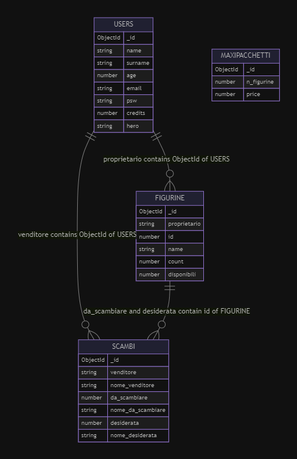

# Progetto
Benvenuti nel progetto di Gabriele Cucchi 962790! Questo file README fornisce una panoramica del progetto **Album delle Figurine dei Super Eroi (AFSE)** e delle istruzioni su come utilizzare le funzionalità.

## Diagramma

## Schema database

## Descrizione
Il progetto è un'applicazione web che permette di gestire l'acquisto e scambio di figurine di supereroi Marvel. L'applicazione, oltre alle funzionalità base, offre le seguenti operazioni aggiuntive:
- dalla sezione album ogni utente può [vendere](readme.md#vendita-figurine) le sue figurine in cambio di crediti
- l'utente amministratore, nella sezione dedicata, può generare offerte per pacchetti di figurine maxi contenenti da 6 a 30 figurine e il prezzo può andare da 1 a 5 crediti. Nella stesssa sezione tutti gli altri utenti possono acquistare le offerte per i pacchetti di figurine. Per maggiori informazioni realtive all'utente amministratore visita la sezione [dedicata](readme.md#utente-amministratore)
- per quanto riguarda gli [scambi](readme.md#scambi) sono gestiti i controlli di integritàin modo che:
    - non si possano accettare scambi dove la figurina in arrivo è già presente nell’album
    - non si possono creare scambi dove la figurina in arrivo e in uscita coincidono

### Vendita figurine
Ad ogni figurina è asseganto il valore "commerciale" di 1 credito.
L'utente può vendere una figurina anche se ne possiede solamente 1 copia.

### Utente amministratore
L'utente amministratore **DEVE** avere le seguenti caratteristiche:
- nome $\to$ admin
- cognome $\to$ admin
- mail $\to$ admin@admin.it

La stringa esadecimale relativa all'_id legato all'amministratore è salvata nel file [index.js](backend/index.js), più precismanete nella costante adminId, in caso di ricreazione dell'utente amministratore deve essere modificato il valore della costante

### Scambi
Nella sezione relativa alla visualizzazione degli scambi sono presenatte due liste separate:
- **scambi creati** $\to$ la lista degli scambi creati dall'utente
- **scambi disponibili** $\to$ la lista degli scambi che l'utente è in condizione di poter accettare.

Per essere in consizione di accettare uno scambio un utente deve essere in possesso della figurina desiderata da chi ha creato lo scambio e deve averene un numero sufficiente di copie [disponibili](readme.md#copie-disponibili-di-una-figurina).

**N.B.** Un utente può scambiare una figurina anche se ne possiede solo una copia.

### Creazione di uno scambio
La lista delle carte che possono essere messe in scambio viene automaticamente generata a partire da quelle disponibili, mentre per la figurina desiderata la lista viene reperita da quella dei supereroi disponibili sul serve. In particolare va inserito il nome che si vuole ricercare nell'apposito input e la lista viene popolata in seguito alla rispsota del server.

#### Copie disponibili di una figurina
Le copie disponibili di una figurina sono definite secondo la seguente formula:

$$Copie_{disponibili} = Copie_{possedute} - N_{scambi} $$

dove $N_{scambi}$ indica il numero di scambi creati dall'utente in cui quella figurina viene proposta come oggetto dello scambio.

## Struttura del progetto
All'interno della cartella [frontend](frontend/) sono contenuti i file relativi all'implementazione del frontend.

All'interno della cartella [backend](backend/) sono contenuti i file relativi all'implementazione del frontend.
In particolare:
- [index.js](backend/index.js) $\to$ contiene le istruzioni realtive al server e va eseguito tramite Node
- [script.js](backend/script.js) $\to$ contiene le funzioni comuni a più parti del progetto
- [swagger.js](backend/swagger.js) $\to$ contiene le istruzioni realtive alla creazione dello swagger

# Considerazioni sulle prestazioni
Si vuole sottolineare che durante la realizzazione del progetto (lugio/Agosto 2024) il server marvel incaricato della Gestione delle chiamte API è notevolmente rallenatato e al momento l'esperienza dell'utente finale è altamente compromessa, d'altraparte si è scelto di continuare a usufruire del server e non trovare altre soluzioni (per esempio "congelando" i dati in un file statico dal quale attingere) a fini didattici e per attenersi alle richieste del docente. 